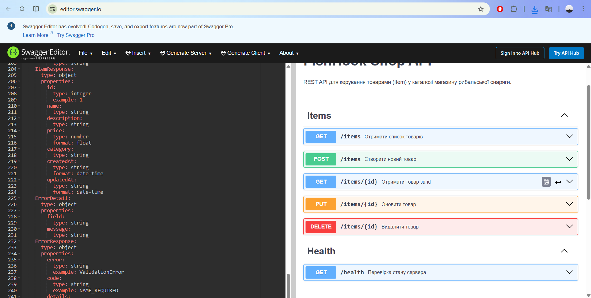

# FishHook Shop

Онлайн-магазин рибальської снаряги (навчальний проєкт).

## Стек

- Backend: Node.js + Express + SQLite
- Frontend: React (Vite)
- Архітектура: модульний моноліт, DDD-орієнтований дизайн

## API документація

Контракт REST API описано в файлі:

- [`docs/api/openapi.yaml`](docs/api/openapi.yaml)

Вигляд API-документації у Swagger Editor:

## CI / CD

У репозиторії налаштований GitHub Actions workflow `.github/workflows/ci.yml`, який:

- запускається на push та pull_request у гілку `main`
- встановлює залежності для backend
- запускає тести backend (`npm test`)
- збирає Docker-образ backend API
- зберігає образ як артефакт виконання

Статус CI:

