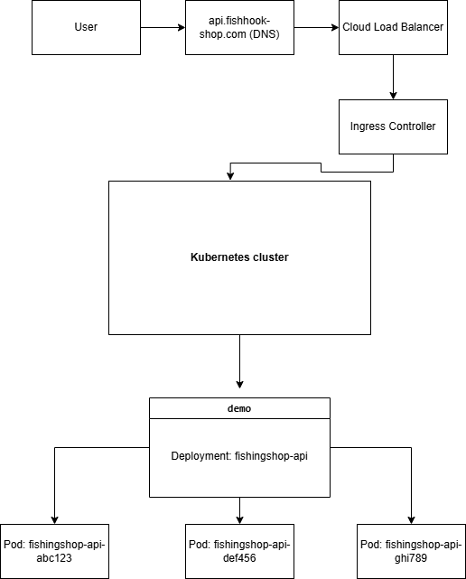

Я моделюю бекенд-сервіс курсового проєкту — API магазину рибальської снаряги `fishingshop-backend`. У Kubernetes він розгорнутий у namespace `prod` у вигляді Deployment `fishingshop-api` з трьома Pod-ами, кожен з контейнером на основі образу `ghcr.io/lordlunar1337/fishingshop-api:v1.0.0`. Зовні користувачі звертаються до домену `api.fishhook-shop.com`, запит проходить через DNS, Load Balancer, Ingress-контролер і потрапляє до Service `fishingshop-api-svc`, який рівномірно розподіляє трафік між Pod-ами. Код зберігається в git-репозиторії на GitHub, після push спрацьовує CI/CD (GitHub Actions), який збирає Docker-образ, пушить його в GitHub Container Registry, а Kubernetes Deployment під час оновлення підтягує нову версію образу для Pod-ів.

